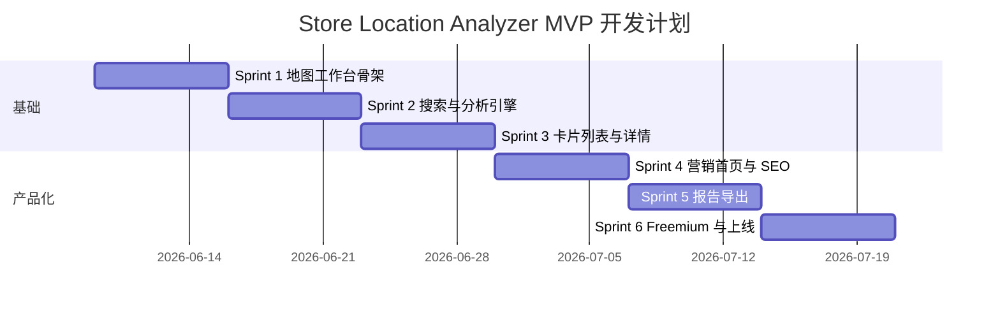

基于 `doc/mvp.md` 和当前代码库现状，整理如下 **Store Location Analyzer 海外版 MVP 开发计划**。

---

## 现状评估

| 模块 | MVP 要求 | 当前实现 |
|------|----------|----------|
| `/map` 全屏地图 | 100vw×100vh + 左侧浮层面板 | ✅ 布局骨架已有（`layout.tsx` + 浮层 aside） |
| 地图交互 | 搜索、选点、多站点卡片 | ❌ 仅硬编码单 POI 演示 |
| 分析引擎 | 竞品/客流/设施 + 评分 | ❌ 未实现 |
| `/` 营销首页 | Hero、SEO、Pricing、FAQ | ❌ 首页仍是 Supabase Todo 演示 |
| 报告导出 | PDF/HTML | ❌ 未实现 |
| 用户/额度 | Supabase Freemium | ⚠️ 有 Auth + Todo，需改造为报告存储 |
| UI 框架 | Tailwind + SaaS 落地页 | ❌ 当前为 inline style |

**结论**：技术底座（Next.js + Google Maps + Supabase）已具备，核心产品逻辑和营销页几乎从零开始。建议按 MVP 文档第 6 节优先级推进。

---

## 总体目标

**1–2 个月 solo 可交付**：用户从首页进入 → `/map` 搜索/选点 → 查看评分卡片 → 导出报告。

**主路径**：`/` → CTA → `/map` → 分析 → 导出

---

## 里程碑规划（6 个 Sprint，每 Sprint ≈ 1 周）



---

### Sprint 1：地图工作台骨架（Week 1）

**目标**：把 `/map` 从「单点演示」升级为完整工作台 UI 骨架。

**任务清单**：

1. **引入 Tailwind CSS**，统一设计 token（圆角、阴影、z-index 层级）
2. **重构 `/map` 布局**（对齐 MVP 3.1）：
   - z-0：全屏 Google Map
   - z-10：左侧 Menu 面板（320–420px，可滚动）
   - z-20：顶栏（搜索、导出、New Analysis）
   - z-30：详情抽屉 / Street View 模态
3. **状态管理**：引入 `SiteCandidate[]` 本地 state（地址、坐标、stage、score）
4. **Kanban 列**：MVP 简化为「待分析 / 已分析」两列
5. **路由调整**：`/map` 无需登录即可访问（MVP 获客优先）

**交付物**：可交互的空工作台，支持「+ Add a site」创建空卡片。

**文件规划**：

```
app/map/
  page.tsx              # 主容器，组合子组件
  layout.tsx            # 已有，补充 metadata
  components/
    MapCanvas.tsx       # Google Map 实例
    SitePanel.tsx       # 左侧浮层面板
    SiteCard.tsx        # 单站点卡片
    TopToolbar.tsx      # 顶栏工具条
lib/types/site.ts       # SiteCandidate 类型定义
```

---

### Sprint 2：搜索与分析引擎（Week 2）

**目标**：实现核心差异化——3 分钟出分析结果。

**任务清单**：

1. **地址搜索**
   - Places Autocomplete（顶栏搜索框）
   - Geocoding API（地址 → 坐标）
   - 地图点击/拖拽 → 「Add pin here」
2. **周边分析 API 层**（`app/api/analyze/route.ts`）：
   - `Places Nearby Search`：半径内同类 POI（竞品）
   - 规则加权：写字楼/住宅/学校/地铁 POI 密度 → 客流 proxy
   - 配套设施：停车、公交、餐饮 POI 计数
3. **评分系统**（`lib/scoring/`）：
   - 维度：人流潜力、竞争强度、可见度
   - 输出 0–100 分 + Bad/OK/Good/Great 标签
   - MVP 用规则模板，预留 AI 增强接口
4. **API 成本控制**：
   - 服务端缓存 Geocode 结果（内存/Supabase）
   - 分析结果写入 session/localStorage，避免重复请求

**交付物**：搜索地址后 5–10 秒内返回评分 + 三维分析摘要。

**数据流**（对齐 MVP 5）：

```
Search → Geocode → Places Nearby → Rule Score → SiteCard
```

---

### Sprint 3：卡片列表与地图联动（Week 3）

**目标**：Kanban 工作台完整交互闭环。

**任务清单**：

1. **SiteCard 字段**：地址、Overall Score、迷你趋势占位、状态标签
2. **双向同步**：
   - 点击卡片 → 地图 `panTo` + Marker 高亮 + InfoWindow
   - 点击 Marker → 卡片选中态
3. **详情展开**（选中站点后面板内）：
   - Competition：半径内 POI 数 + 最近 5 家名称/评分
   - Foot traffic proxy：加权分 +  breakdown
   - Amenities：停车/公交/餐饮条
   - 一句话建议（规则模板）
4. **Street View**：卡片操作项打开 Panorama 模态
5. **Stage 切换**：下拉改「待分析 → 已分析」
6. **响应式**：移动端面板改为底部抽屉（MVP 3.7）

**交付物**：多站点管理 + 地图联动 + 分析详情可读。

---

### Sprint 4：营销首页与 SEO（Week 4）

**目标**：获客落地页，所有 CTA 指向 `/map`。

**任务清单**：

1. **新建 `/` 营销页**（替换当前 Todo 页，Todo 可移至 `/dashboard` 或删除）
2. **页面区块**（对齐 MVP 2）：
   - Hero + 主 CTA → `/map`
   - 痛点与价值主张
   - SEO 正文 A/B/C（嵌入核心关键词）
   - How It Works 三步
   - 核心功能亮点（截图占位）
   - Testimonials（占位文案）
   - Pricing 预览（Free / Pro / One-time）
   - FAQ（5 条，链向 `/map`）
   - Footer CTA + Privacy/Terms/Contact
3. **SEO 配置**（`app/layout.tsx` + 首页 metadata）：
   - title: `Store Location Analyzer | Retail Site Selection Tool`
   - meta description 含 store location analyzer、retail site selection
   - 语义化 H1/H2 结构
4. **`/map` metadata**：`Site Analysis Map | Store Location Analyzer`

**交付物**：可索引的营销首页，移动端优先。

---

### Sprint 5：报告导出（Week 5）

**目标**：一键导出可分享的分析报告。

**任务清单**：

1. **HTML 报告模板**（`lib/report/template.ts`）：
   - 地图静态截图（`Static Maps API` 或 html2canvas）
   - 评分摘要 + 三维 breakdown
   - 竞品列表 + 建议文案
2. **PDF 导出**：
   - 方案 A：`@react-pdf/renderer` 纯 React 生成
   - 方案 B：HTML → `html2pdf.js` / 浏览器 print
   - MVP 优先方案 B（更快）
3. **顶栏 Export 按钮**：导出当前选中站点 / 全部站点
4. **报告样式**：简洁白底，适合发给 landlord/partner

**交付物**：点击 Export → 下载 PDF 或 HTML 文件。

---

### Sprint 6：Freemium 与上线准备（Week 6）

**目标**：商业化边界 + 部署上线。

**任务清单**：

1. **Supabase 数据模型**：
   ```sql
   -- sites: 用户保存的候选站点
   -- analyses: 分析结果快照
   -- usage: 每月分析次数计数
   ```
2. **Freemium 额度**：
   - Free：3 次/月（未登录用 localStorage 计数，登录用 Supabase）
   - 超额提示升级 Pro
3. **登录流程**（复用现有 Auth）：
   - MVP：分析可匿名，导出/保存需登录
   - 或：分析 3 次后强制登录
4. **法律页**：Privacy Policy、Terms of Service（模板即可）
5. **部署**：
   - 环境变量：`NEXT_PUBLIC_GOOGLE_MAPS_API_KEY`、Supabase keys
   - Google Cloud Console：限制 API key 域名
   - Amplify / Vercel 部署
6. **监控**：Google API 用量告警、错误追踪（Sentry 可选）

**交付物**：可对外 Beta 的 Freemium 产品。

---

## 技术架构建议

```
app/
├── page.tsx                    # 营销首页（Sprint 4）
├── map/
│   ├── page.tsx
│   ├── layout.tsx
│   └── components/             # Sprint 1–3
├── api/
│   ├── analyze/route.ts        # 周边分析 + 评分（Sprint 2）
│   └── report/route.ts         # 报告生成（Sprint 5）
├── (auth)/                     # 已有，Sprint 6 复用
lib/
├── scoring/                    # 规则评分引擎
├── report/                     # 报告模板
├── types/site.ts
└── supabase/                   # 已有
```

**新增依赖建议**：

| 包 | 用途 |
|----|------|
| `tailwindcss` | UI 样式 |
| `@headlessui/react` | 模态/抽屉 |
| `html2canvas` + `jspdf` | PDF 导出 |
| `zustand` 或 React Context | 多站点 state |

---

## 风险与约束

| 风险 | 应对 |
|------|------|
| Google API 成本 | 服务端缓存、Free 限额 3 次/月、Nearby Search 半径限制 500m |
| 评分准确性 | MVP 明确标注「estimate / proxy」，不做 foot traffic 数据承诺 |
| 1 人工期 | Phase 2 功能（多地点对比、行业 filter、博客）严格排除 |
| 首页与 Todo 冲突 | Sprint 4 将 `/` 改为营销页，Auth 演示移走或删除 |

---

## Phase 2  backlog（MVP 后）

按 MVP 文档 1.5，以下**不纳入首版**：

- 多地点对比表格
- 垂直行业 filter（coffee / retail / gym）
- 人口/收入叠加层
- 保存项目 & 团队共享
- 独立报告页 `/report/[id]`
- 博客 SEO 内容

---

## 建议的下一步

若你认可这份计划，建议从 **Sprint 1** 开始：

1. 安装 Tailwind
2. 拆分 `/map/page.tsx` 为 MapCanvas + SitePanel + SiteCard
3. 建立 `SiteCandidate` 类型与本地 state

需要的话，我可以直接开始 Sprint 1 的代码实现，或把这份计划写入 `doc/plan.md` 供团队跟踪。